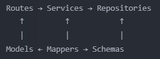

# Setup and Run The Project

This README provides instructions on how to set up the virtual environment, install the required packages, set up MinIO, and run the application.

## Prerequisites

- Python 3.11 or higher
- pip (Python package installer)
- MinIO Server (for object storage)

## Setup Instructions

### Step 1: Clone the Repository

Clone or download this repository to your local machine.

### Step 2: Create a Virtual Environment

#### Windows
```bash
# Navigate to the project directory
cd project-directory

# Create a virtual environment
python -m venv venv

# Activate the virtual environment
venv\Scripts\activate
```

#### Mac/Linux
```bash
# Navigate to the project directory
cd project-directory

# Create a virtual environment
python3 -m venv venv

# Activate the virtual environment
source venv/bin/activate
```

### Step 3: Install Requirements

Once the virtual environment is activated, install the required packages:

```bash
pip install -r requirements.txt
```

### Step 4: Set Up MinIO

MinIO is an object storage server compatible with Amazon S3. Follow these steps to set it up:

#### docker compose (recommended)
Run
```bash
docker compose up -d minio
```

#### Windows

1. Download the MinIO Server for Windows from the [official MinIO website](https://min.io/open-source/download?platform=windows)
2. Create a directory for MinIO data:
```bash
mkdir C:\minio\data
```
3. Start MinIO Server:
```bash
minio.exe server C:\minio\data --console-address ":9001"
```

#### macOS

1. Install MinIO using Homebrew:
```bash
brew install minio/stable/minio
```
2. Create a directory for MinIO data:
```bash
mkdir -p ~/minio/data
```
3. Start MinIO Server:
```bash
minio server ~/minio/data --console-address ":9001"
```

4. Access the MinIO Console at http://localhost:9001 and set up your access credentials

MinIO URL to Connect
MinIO Console (Web UI):
👉 http://localhost:9001
(Login with user credentials configured in docker compose)

MinIO API (For SDKs and CLI):
👉 http://localhost:9000


### Step 5: Set Up Environment Variables

The project uses environment variables for configuration. You need to create a `.env` file based on the provided template:

1. Make a copy of the `.env.example` file and rename it to `.env`:

#### Windows
```bash
copy .env.example .env
```

#### Mac/Linux
```bash
cp .env.example .env
```

2. Open the `.env` file in a text editor and fill in the required values for all environment variables, including the MinIO credentials:
```
MINIO_ENDPOINT=localhost:9000
MINIO_ACCESS_KEY=your_access_key
MINIO_SECRET_KEY=your_secret_key
MINIO_BUCKET_NAME=your_bucket_name
MINIO_SECURE=False
```

### Step 6: Run the Application

After installing all requirements and setting up MinIO, you can run the application:

```bash
python main.py
```

## Deactivating the Virtual Environment

When you're done working on the project, you can deactivate the virtual environment:

#### Windows/Mac/Linux
```bash
deactivate
```

## Troubleshooting

If you encounter any issues:

1. Ensure you have the correct Python version installed
2. Make sure the virtual environment is activated before installing requirements
3. Check that all the required packages are listed in requirements.txt
4. Verify that MinIO server is running and accessible
5. Ensure your MinIO credentials in the `.env` file are correct

For further assistance, reach out on whatsapp.

# Project Structure Brief
## Structure Layers
### 1. Models Layer `models/`
- Contains Pydantic models that represent the API contract
- These models define what clients send to and receive from your API
- No MongoDB-specific logic here

### 2. Schema Layer `db/schemas/`
- Contains Pydantic models specific to database representation
- Handles MongoDB-specific fields and validation

### 3. Mappers Layer `mappers/`
- Pure functions that convert between schemas and models
- Focused solely on data transformation logic
- No database or business logic

### 4. Repository Layer `repos/`
- Abstracts database access operations
- Handles CRUD operations and querying
- Knows nothing about API models or business rules
- Returns and accepts database schemas only

### 5. Service Layer `services/`
- Implements business logic and orchestrates operations
- Uses repositories for data access
- Uses mappers to convert between schemas and models
- Enforces business rules (e.g., uniqueness checks)

### 6. API Layer `routes/`
- Defines HTTP endpoints
- Handles request validation and response formatting
- Delegates to services for business operations
- Focused on HTTP-specific concerns

## Structure Flow

- Routes only depend on Services and Models (not Schemas or Repositories)
- Services coordinate between Repositories and Mappers
- Repositories only work with Schemas
- Mappers bridge between Models and Schemas

### Example Flow
For a user creation operation:
1. **Route layer** receives a UserCreate model from the client
2. **Route layer** calls the service's create_user method
3. **Service layer** validates business rules (e.g., unique username)
4. **Service layer** uses mappers to prepare data for storage
5. **Service layer** calls repository to store the data
6. **Repository layer** interacts with MongoDB
7. **Service layer** uses mappers to convert the result to a response model
8. **Route layer** returns the response model to the client